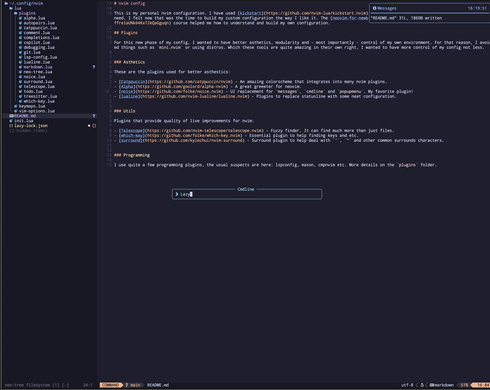

# nvim config

This is my personal nvim configuration. I have used [kickstart](https://github.com/nvim-lua/kickstart.nvim) for over a year, tweaking and modifying for what I need. I felt now that was the time to build my custom configuration the way I like it. The [neovim-for-newbs](https://www.youtube.com/playlist?list=PLsz00TDipIffreIaUNk64KxTIkQaGguqn) course helped me how to understand and build my own configuration.

## Plugins

For this new phase of my config, I wanted to have better asthetics, modularity and - most importantly - control of my own environment. For that reason, I avoided things such as `mini.nvim` or using distros. While these tools are quite amazing in their own right, I wanted to have more control of my config not less.

### Asthetics

These are the plugins used for better asthestics:

- [Catppuccin](https://github.com/catppuccin/nvim) - An amazing colorscheme that integrates into many nvim plugins.
- [Alpha](https://github.com/goolord/alpha-nvim) - A great greeeter for neovim. 
- [noice](https://github.com/folke/noice.nvim) - UI replacement for `messages`, `cmdline` and `popupmenu`. My favorite plugin!
- [lualine](https://github.com/nvim-lualine/lualine.nvim) - Plugins to replace statusline with some neat configuration.

### Utils

Plugins that provide quality of live improvements for nvim:

- [Telescope](https://github.com/nvim-telescope/telescope.nvim) - Fuzzy finder. It can find much more than just files.
- [which-key](https://github.com/folke/which-key.nvim) - Essential plugin to help finding keys and etc. 
- [surround](https://github.com/kylechui/nvim-surround) - Surround plugin to help deal with `'`, `"` and other common surrounds characters.

### Programming

I use quite a few programming plugins, the usual suspects are here: lspconfig, mason, cmpnvim etc. More details on the `plugins` folder.
